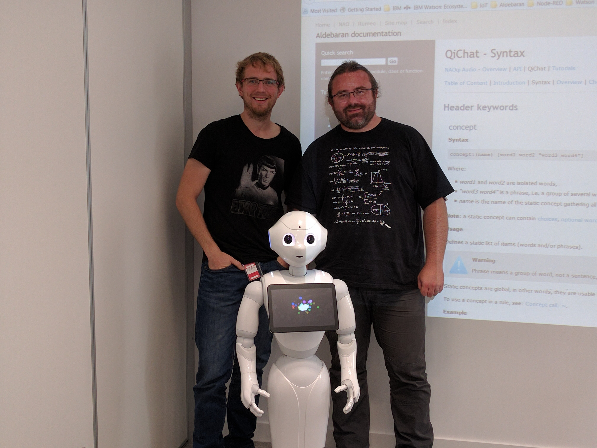

Bienvenue sur le blog de FastIT

Nous avons le grand privilège d'être dans les locaux d'IBM pour nous former à l'utilisation du robot Pepper de la société Aldebaran.

1 seule semaine pour apprendre les rudiments de la programmation de robot, et se familiariser avec les services cognitifs de Bluemix (le SASS de IBM).

Ca va être chaud !

Après quelques heures on sait allumer, éteindre, rebooter le robot.
Pepper a un mode de vie *autonome*, plutôt drôle au départ, assez agaçant rapidement... elle essaye de comprendre son environnement, mais se trompe souvent, et croit qu'on s'adresse a elle tout le temps... dur dans une salle de cours.

l'inevitable selfie!

Très vite on enchaine sur l'IDE conçu par Aldebaran pour *piloter* le robot, *programmer* *déployer* les *behaviors* de pepper.

On passe pas mal de temps à *comprendre* les possibilités d'intéraction verbale avec le robot.
Le module de *dialog* est bien fait et complet. Il interagit avec le reste du robot au moyen d'events, et fourni une super base de travail.
Pepper a un lexique verbal extrêmement limité, en fait, elle ne comprend que ce qu'elle connait.
Ce qui implique de lui fournir au préalable une bonne liste de mots qu'elle pourrait comprendre. Sinon elle va essayer de trouver le best match parmi les mots qu'elle attend.

C'est assez perturbant au départ. Mais ça lui donne un vrai contexte d'évolution. Et une fois le lexique defini, la reconnaissance vocale est excellente, fiable et rapide.
Le lexique est défini pour un scénario de *dialog*.

Ce qu'il faut en retenir, c'est que les dialogues sont au final des scripts, si on se trouve dans un cas non traité on fait partir le dialogue dans une impasse... ou Pepper va attendre indéfiniment un mot clef.

<iframe width="560" height="315" src="https://www.youtube.com/embed/ZiwSsHlAMM8" frameborder="0" allowfullscreen></iframe>

La suite plus tard!
Nous vous tiendrons informé de l'avancée de la formation et du projet, repassez souvent!

