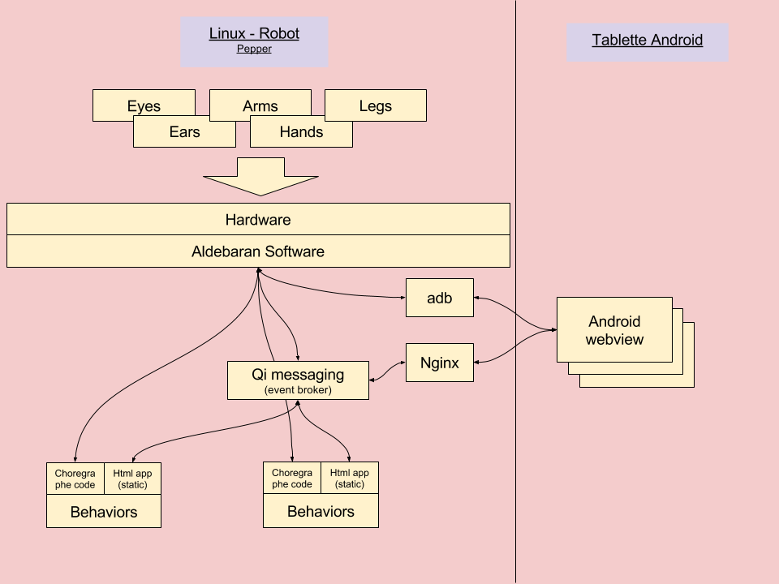
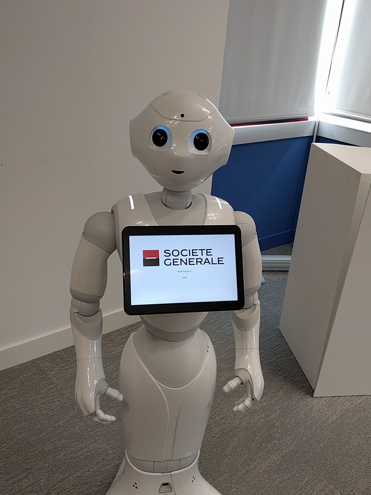

# La tablette

Ce matin, travail avec la tablette de Pepper.
C'est une tablette Android, pas très recente, mais suffisament (HTML5 ready)...

## Comment on discute avec la tablette depuis le robot ?

Pour bien comprendre comment ça fonctionne, d'abord qu'est ce que c'est que ce robot?

Macro architecture of the robot

An image is better than words !

Pepper est donc un linux, avec pleins de péripheriques: des caméras, des haut parleurs, des capteurs, des moteurs, bref pleins (pleins). Qui dit peripheriques, dit drivers, et donc évenements qui sont remontés à l'OS. Charge au dev des applis d'écouter ces évenements ou pas. Tout ça est très simple dans choregraphe.

La tablette n'est pas un périphérique.
C'est un autre système (Android), qui est accessible sur le réseaux du robot.

Donc la communication entre la tablette et le robot est faite à travers un nginx qui expose du contenu pour la tablette.
Du contenu statique, disponible dans les behaviors (répertoire html à la racine du code des behaviors) et du contenu plus dynamic au travers d'un système de messaging (QiMessaging)
On a aussi accés a une partie du SDK android depuis le robot et donc piloter la tablette à travers le SDK.

On va donc pouvoir démarrer une webview android sur la tablette, et faire pointer cette webview sur une URL de notre choix.

Un peu de magie intervient quand on charge dans notre appli web la librairie de messaging (fournie avec le robot), qui va communiquer avec le backend de messaging du robot, et donc créer un systeme de publish-subscribe entre l'appli web dans la webview de la tablette et le robot lui meme!

Et là, la tablette peut réagir à des évenements issu du robot, et emmettre des évenements pour alerter le robot d'action (touch par exemple) sur la tablette !

## Ce qu'on a réalisé?

Et oui, on a mit Pepper au couleur de la SG !

So much Pride !
